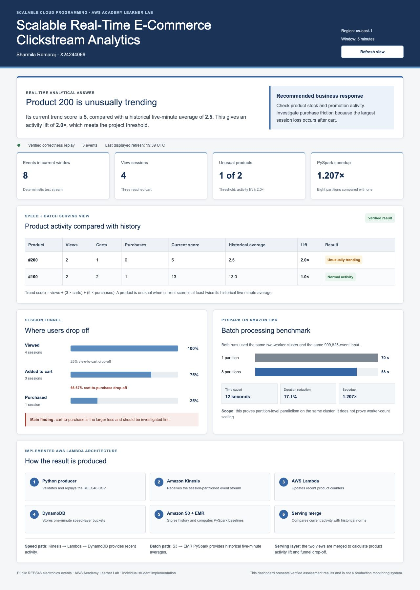

# Scalable Real-Time E-Commerce Clickstream Analytics

**Student:** Sharmila Ramaraj (X24244066)
**Module:** Scalable Cloud Programming, National College of Ireland

This project answers one operational question:

> Which products are experiencing unusual increases in customer activity during the last five minutes, and whether the larger customer drop-off is from view to cart or from cart to purchase?

It replays the public REES46 multi-category e-commerce behaviour dataset as a live stream and implements a Lambda architecture:

- **Batch layer:** PySpark calculates historical five-minute product baselines and funnel behaviour.
- **Speed layer:** Python/Kinesis processing maintains recent minute buckets and sliding-window counts.
- **Serving layer:** recent activity is compared with historical baselines to flag unusual trends.
- **Presentation layer:** a clear student-built dashboard explains the trend signal, funnel drop-off, AWS event flow, and measured batch performance.
- **Scaling:** EMR managed scaling was configured for 2-4 workers; Kinesis and Lambda provide elastic stream processing within the Learner Lab limits.

The dataset provides `view`, `cart`, `remove_from_cart`, and `purchase` events. It does not contain a checkout-start event, so this project deliberately reports view-to-cart and cart-to-purchase drop-off—not checkout-page abandonment.

## Repository layout

```text
src/clickstream_analytics/
  models.py       canonical event schema
  producer.py     CSV/CSV.GZ replay to JSONL or Kinesis
  speed.py        local five-minute sliding-window engine
  serving.py      batch + speed merge
jobs/
  batch_baseline.py  distributed PySpark batch job
  sequential_baseline.py single-process reference/T(1) job
  speed_lambda.py    Kinesis-triggered AWS speed processor
docs/
  project-specification.md
  architecture.md
  aws-deployment.md
  assessment-work-plan.md
  load-and-scaling-experiments.md
infrastructure.yaml  safe core AWS resources
tests/               deterministic fixtures and automated tests
dashboard/           responsive Next.js results dashboard
benchmarks/          measured EMR timing evidence
output/pdf/           rendered IEEE-style report
```

## Verified result

The deterministic live replay contained eight events across two products and four sessions.

- Product **200** scored **5** against a historical five-minute mean of **2.5**. Its **2.0x activity lift** met the unusual-trend threshold.
- Product **100** scored **13** against a mean of **13**. Its **1.0x lift** was normal.
- View-to-cart drop-off was **25%**; cart-to-purchase drop-off was **66.67%**. The larger immediate loss was therefore after cart.
- The Kinesis-triggered Lambda populated the expected **three DynamoDB rows**: two product aggregates and one processing-health row.

For batch performance, five S3-side copies of the 199,965-event canonical subset produced a **999,825-event (~290 MB)** input. On the same two-worker EMR cluster, one partition completed in **70 seconds** and eight partitions in **58 seconds**: a **1.207x speedup** and **17.1% lower duration**. This is a controlled partitioning comparison, not proof of worker auto-scaling.



## Run the dashboard

```bash
cd dashboard
npm install
npm run dev
```

Open [http://localhost:3000](http://localhost:3000). The display includes the verified trend answer, a product comparison table, the three-stage funnel, a simple benchmark chart, and a numbered AWS-flow explanation. All numerical labels come from the verified experiment.

## Run the local demonstration

Python 3.11 or newer is sufficient for the local pipeline:

```bash
chmod +x scripts/run_local_demo.sh
./scripts/run_local_demo.sh
cat data/output/serving.json
```

Run the dependency-free tests:

```bash
PYTHONPATH=src python3 -m unittest discover -s tests -v
```

Installing `.[test]` also allows the same suite to run with `pytest`.

Replay a real downloaded REES46 file locally:

```bash
clickstream-replay 2019-Oct.csv.gz \
  --rate 500 \
  --limit 100000 \
  --output data/output/replayed.jsonl
```

Replay into AWS Kinesis:

```bash
python3 -m pip install -e '.[aws]'
clickstream-replay 2019-Oct.csv.gz \
  --rate 500 \
  --limit 100000 \
  --kinesis-stream clickstream-analytics-events \
  --region YOUR_LAB_REGION
```

The producer partitions Kinesis records by `session_id`, preserving the order of each customer's journey.

The batch jobs prefer `source_event_time` so historical five-minute baselines retain the original dataset's time distribution. The speed layer uses rebased `event_time`, which represents the live replay clock.

## Data source

REES46 publishes anonymised e-commerce behaviour data with product views, category views, cart additions/removals, and purchases. Monthly compressed files are available from the [REES46 dataset catalogue](https://data.rees46.com/). Download one month for development and use a controlled subset for AWS experiments.

## Current status

- Core Kinesis, Lambda, DynamoDB, S3, and EMR resources were deployed in the AWS Academy Learner Lab.
- The deterministic cloud replay and DynamoDB serving evidence were verified.
- The 999,825-event EMR sequential/parallel benchmark was completed.
- Eight automated Python tests and two dashboard production checks pass locally.
- The IEEE-style report and approved dashboard are included.

The main experimental limitation is that managed scaling was configured but the 58-70 second jobs did not sustain demand long enough to demonstrate an observed worker scale-out. A longer repeated backlog test is the next recommended experiment.

The repeatable commands for the three-rate latency test, EMR worker-count monitor, and speedup-versus-worker-count plot are in [Controlled load and auto-scaling experiments](docs/load-and-scaling-experiments.md). Result claims must not be added until those commands have run inside an active Learner Lab session.
