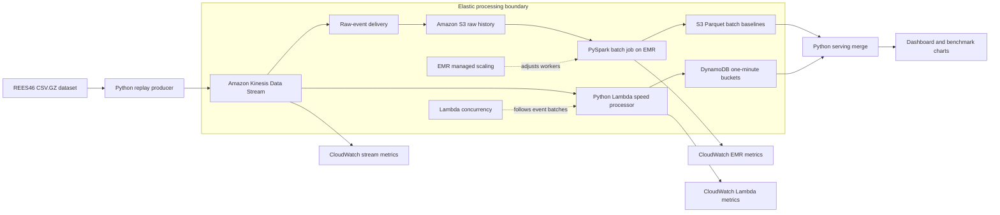

# Architecture and data flow

## Layer responsibilities

| Layer | Responsibility | Output |
|---|---|---|
| Ingestion | Replay a public dataset at controlled rates and preserve session order | Canonical JSON in Kinesis |
| Raw history | Retain all accepted records for recomputation | Partitioned S3 objects |
| Batch | Calculate accurate historical five-minute baselines and funnel totals | Parquet/JSON baselines in S3 |
| Speed | Increment current one-minute product counters with low latency | DynamoDB window buckets |
| Serving | Merge the latest five buckets and compare them with batch averages | Trend lift and funnel view |
| Observability | Record rates, duration, backlog, errors and scaling | Benchmark dataset and graphs |

## Parallelism

- **Data parallelism:** Spark partitions events by product and distributes window aggregations.
- **Task parallelism:** EMR executors process independent partitions across worker nodes.
- **Stream parallelism:** Kinesis shards distribute sessions, with `session_id` as the partition key.
- **Independent task paths:** raw storage, speed processing, and monitoring consume the stream without blocking the batch view.

## Planned scaling policy

Use EMR managed scaling with a small lab-safe range, initially one primary node plus one to four core/task workers. Capture the exact minimum, maximum, scaling event timestamps, and cooldown/decision behaviour shown by the Learner Lab deployment. Kinesis starts with one shard for the low-load run; shard count is increased for higher controlled rates only when justified by backlog measurements.

The final report must use the settings actually deployed rather than copying planned values.
